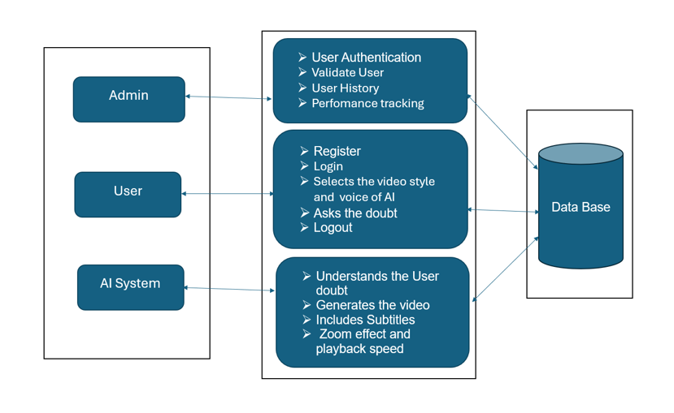
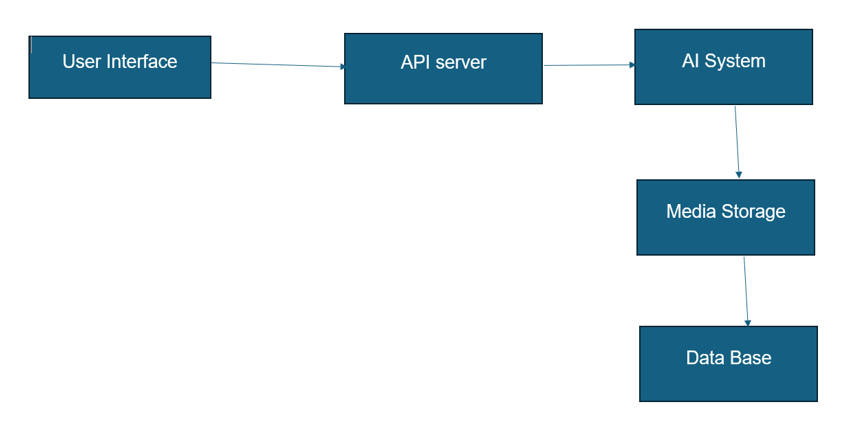
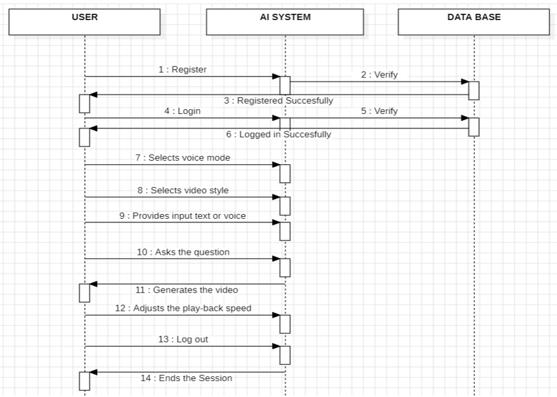

# 🎬 VidGenie – Real-Time AI Video Generation System

🚧 **Project Status: Under Active Development**

## 📖 Project Overview

VidGenie is a Real-Time AI-powered Video Generation System that allows users to generate customized short videos from textual topics. 

The system integrates a Flutter frontend with a Django backend and MySQL database to automate video generation workflows.

It provides:
- User authentication
- AI-driven script processing
- Video generation
- 30-day history tracking
- Shareable video links
🎯 3. Problem Statement

## ❗ Problem Statement

Creating short educational or promotional videos requires time, editing skills, and expensive software tools. 

VidGenie aims to automate the video creation process using AI to:
- Reduce manual editing effort
- Generate videos instantly
- Provide accessible content creation tools for students and professionals

## 🎓 Research Scope

This project is designed to explore the implementation of:

- AI-assisted media generation
- Automated video creation workflows
- Real-time request handling using REST APIs
- Database-driven video lifecycle management

Currently, the system provides a structured framework for integrating AI modules into a scalable video generation platform.

## 👥 Target Users

- Students
- Educators
- Content creators
- Social media marketers
- Small business owners

## 🏗 System Architecture

### 1️⃣ Software Architecture

The software architecture of VidGenie follows a modular layered design consisting of:

• Presentation Layer – Flutter-based user interface  
• Application Layer – Django REST API handling requests  
• AI Processing Layer – Responsible for video generation logic  
• Data Layer – MySQL database for user and video storage  

This structure ensures separation of concerns, scalability, and maintainability.

### 2️⃣ Technical Architecture

Explanation:

The technical architecture defines the runtime flow of the system:

User Interface → API Server → AI System → Media Storage → Database

The API server acts as a bridge between the frontend and AI engine. 
Generated media files are stored securely and metadata is maintained in the database.

## 🔄 Video Generation Workflow

### Workflow Steps:

1. User logs into Flutter app
2. User enters topic and selects voice/style
3. Request sent to Django backend
4. Backend processes data and triggers AI module
5. Video generated
6. Video stored in database
7. Video available in 30-day history
🗄 8. Database Design

Explain tables:

## 🗄 Database Design

### Users Table
- id
- username
- email
- password
- created_at

### Videos Table
- id
- user_id (Foreign Key)
- topic
- voice_type
- style_type
- video_path
- created_at
- expiry_date (30 days logic)

## 🔐 Authentication Flow

- User registers via API
- Credentials stored securely
- JWT-based login system
- Token required for video generation

## 🔌 API Documentation

### POST /api/register/
Request:
{
  "username": "user",
  "email": "user@gmail.com",
  "password": "password"
}

Response:
{
  "message": "User registered successfully"
}

---

### POST /api/login/
Returns JWT token

---

### POST /api/generate-video/
Body:
{
  "topic": "Artificial Intelligence",
  "voice_type": "Female",
  "style_type": "Educational"
}

---

### GET /api/history/
Returns list of generated videos (valid for 30 days)

## 📱 Application Screenshots

### Login Screen

### Dashboard

### Video Output

## 🛠 Technologies Used

Frontend:
- Flutter
- Dart

Backend:
- Django
- Django REST Framework

Database:
- MySQL

AI Module:
- Python-based processing

Tools:
- VS Code
- GitHub

## ⚙ Installation Guide

### Backend:
1. Navigate to backend folder
2. Install requirements:
   pip install -r requirements.txt
3. Run server:
   python manage.py runserver

### Frontend:
1. Navigate to frontend
2. Run:
   flutter pub get
3. Start app:
   flutter run

## 🔮 Future Improvements

- Advanced AI animation engine
- GPT-based script enhancement
- Multi-language support
- Cloud deployment (AWS)
- Real-time rendering optimization
- In-app video editing tools
- Automated thumbnail generation

## 🏁 Conclusion

VidGenie demonstrates the integration of AI-driven automation with full-stack mobile development to simplify video creation workflows. 

The project showcases research-based innovation in real-time content generation systems.

